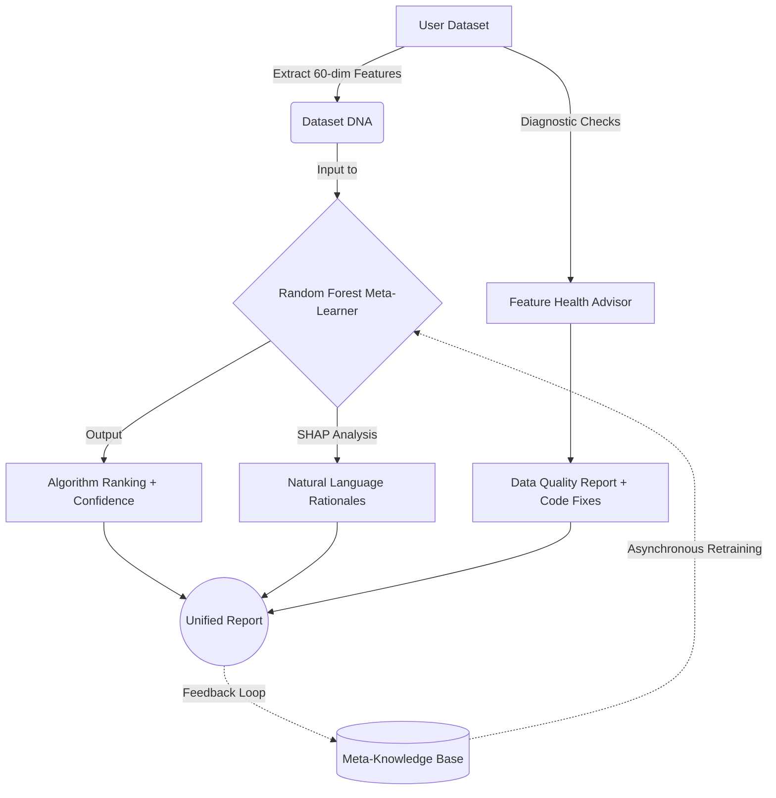

# AMLA - Adaptive Meta-Learning Architecture

[](https://www.python.org/downloads/)
[](https://opensource.org/licenses/MIT)
[](https://fastapi.tiangolo.com)
[](https://reactjs.org/)

**AMLA** (Adaptive Meta-Learning Architecture) is an open-source, intelligent framework designed to automate dataset characterization, predictive algorithm selection, and proactive feature augmentation.

---

## 🛑 The Problem

Manual algorithm selection is a significant bottleneck in applied Machine Learning. 

1. **The Selection Bottleneck:** Data scientists and practitioners often spend 60-80% of project time on trial-and-error, running multiple algorithms simply to see what works. This approach wastes compute resources, time, and requires deep domain expertise.
2. **Black-Box AutoML:** Existing tools (e.g., Auto-sklearn, TPOT) utilize brute-force search and provide a final model pipeline, but offer no explanation for *why* that pipeline was chosen. Users cannot trust or learn from these opaque recommendations.
3. **No Feature Quality Awareness:** Data quality issues—like severe skewness, target leakage, class imbalance, or high dimensionality—silently degrade model accuracy before training even begins. Most AutoML tools do not proactively diagnose these flaws prior to fitting.

## 💡 Our Solution

AMLA eliminates trial-and-error by using **Meta-Learning** ("learning to learn"). Instead of brute-force searching through algorithms, AMLA extracts a 60-dimensional "Dataset DNA" fingerprint from raw tabular data. It then uses a trained meta-learner (backed by a Meta-Knowledge Base of 50+ benchmark experiments) to instantly predict the optimal algorithm. 

Crucially, AMLA explains *why* it made its choice using SHAP values, and runs automated diagnostic checks to catch data quality issues early.

### System Architecture



---

## ✨ Key Features

- 🧬 **Dataset DNA Fingerprinting**: Extracts 60 meta-features across 5 layers (Structural, Statistical, Info-Theoretic, Landmarking, Complexity).
- 🎯 **Smart Algorithm Selection**: Achieves **72% Precision@1** on benchmark datasets in under 200ms.
- 🔧 **Feature Health Advisor**: Detects 10 types of data quality issues (e.g., imbalance, skewness, missing values) and generates Python code remediation snippets.
- 🧠 **Self-Improving System**: Continuous feedback loop retrains the meta-learner as the Meta-Knowledge Base grows.
- 📊 **Explainable AI (XAI)**: Provides SHAP-grounded natural language justifications for every algorithm recommendation.

---

## 🚀 Quick Start

### 1. Installation

```bash
# Clone the repository
git clone https://github.com/pSahoo-456/AMLA-Adaptive-Meta-Learning-Architecture-.git
cd AMLA-Adaptive-Meta-Learning-Architecture-

# Install dependencies
pip install -r requirements.txt
```

### 2. Start Services (API & Web Dashboard)

AMLA features a modern React UI supported by a FastAPI backend.

```bash
# Terminal 1: Start Backend API
python app.py

# Terminal 2: Start React Frontend
cd frontend
npm install
npm run dev
```

Open your browser to **http://localhost:5173**.

---

## 💻 Usage

### Python API

```python
from amla import AMLAPipeline
import pandas as pd

# 1. Load your dataset
df = pd.read_csv('your_dataset.csv')

# 2. Initialize pipeline
pipeline = AMLAPipeline()

# 3. Run analysis
result = pipeline.run(df, target_col='target')

# 4. View results
best_algo = result['algorithm_recommendation']['recommended_algorithm']
confidence = result['algorithm_recommendation']['confidence']

print(f"Best Algorithm: {best_algo} (Confidence: {confidence:.1%})")
```

### Command Line Interface

```bash
# Quick analysis
python main.py --mode analyze --file your_data.csv --target target

# Comprehensive analysis (generates 95+ visualizations)
python main.py --mode comprehensive --file your_data.csv --target target
```

### REST API

```bash
# Analyze a dataset via curl
curl -X POST "http://localhost:8000/analyze" \
  -F "file=@your_data.csv" \
  -F "target_column=target"
```

---

## 🏗️ Meta-Feature Layers ("Dataset DNA")

AMLA extracts a rich 60-dimensional vector organized into five distinct layers:

1. **Structural:** Basic geometry (e.g., n_samples, n_features, missing ratio, class imbalance).
2. **Statistical:** Distribution shapes (e.g., skewness, kurtosis, correlation ratios).
3. **Info-Theoretic:** Information content vs target (e.g., Mutual Information, class entropy).
4. **Landmarking:** Fast probe model accuracies (e.g., Decision Stump, 1-NN) alongside novel gap features ($\Delta$lin/nlin).
5. **Complexity:** Geometric dataset complexity (e.g., PCA variance ratios, intrinsic dimensionality).

---

## 📂 Project Structure

```text
AMLA/
├── amla/                        # Core Engine Package
│   ├── characterizer.py         # 60-dim DNA extraction
│   ├── metalearner.py           # RF Meta-learner & SHAP integration
│   ├── feature_advisor.py       # Data quality diagnostics
│   ├── mkb.py                   # SQLite Meta-Knowledge Base
│   └── pipeline.py              # Unified async pipeline
├── frontend/                    # React + Vite Web Dashboard
├── app.py                       # FastAPI REST Backend
├── main.py                      # CLI entry point
├── data/                        # Benchmark and sample datasets
└── models/                      # Pickled meta-learner models
```

---

## 🧪 Testing & Validation

To run the unit tests and end-to-end smoke tests:
```bash
pytest tests/ -v
```

For performance benchmarks on the internal datasets:
```bash
python demo.py
```

---

## 📄 License

This project is licensed under the MIT License - see the [LICENSE](LICENSE) file for details.
